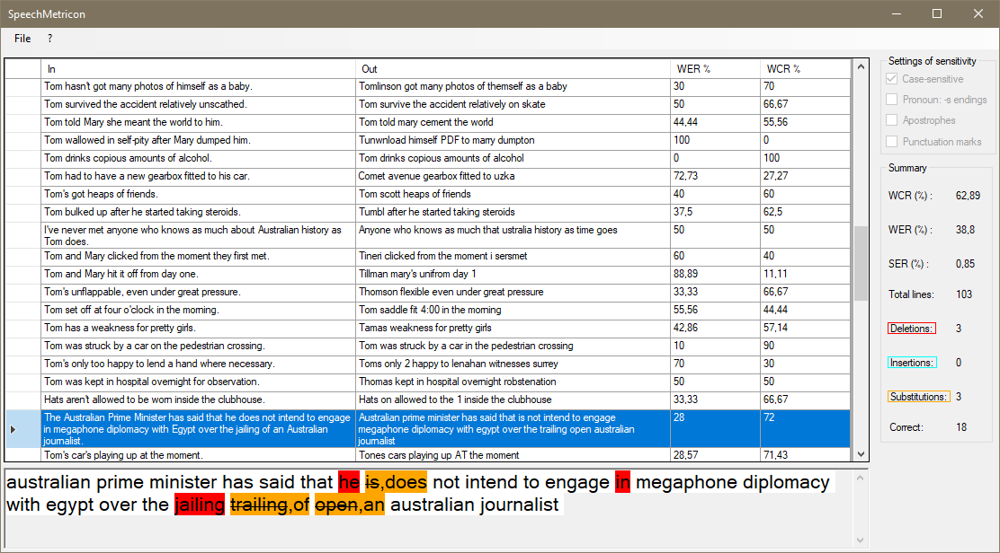

# SpeechMetricon
Small utility which helps to get most important metrics for STT. Inspired by [@imalic3/python-word-error-rate](https://github.com/imalic3/python-word-error-rate) project.


## Features

  - Fast calculation: WER (Word Error Rate), WCR (Word Correct Rate), SER (Sentence Error Rate), Average WER and Average WCR
  - Highlighting 3 types of errors: deletions (red), insertion (cyan), substitution (cyan)
  - Easy report exporting in CSV or XLSX

## Build

Built in VS 2013, Windows 10. Uses only 1 dependency - `EPPlus` (for generating XLSX reports). 
In case of problems with `OfficeOpenXml`, try this one (Package Manager):

```powershell
Install-Package EPPlus
```

## How-To: usage



To begin to work with SpeechMetricon (further in README called "SP"), click `File` - `Open Source`. Then, open plain text file with **references** (input sentences) and press `Open`. Then, choose file with **hypothesis** (output, Speech-To-Text recognition result) and press `Open`.

Main table has 4 columns. 1st and 2nd include texts. 3rd and 4th responsible for Word Error Rate (WER) and Word Correct Rate (WCR).
The bottom part of window shows how selected row in the table can be parsed and highlighted.

Right area has information about other metrics (SER, Average WER, Average WCR).
To save report in XLSX or CSV just press `File` - `Make report CSV` or `Make report XLSX`.

Start using program with examples. First of all, open `input_list.txt`. Next, open `output_list.txt`. Enjoy!

## Metrics explanation

**WER** detects the percent of recognition errors.


**WCR** detects the percent of correctly recognized words and ignores *Insertion* errors.


**SER** shows the percent of sentences with 1 or more errors.

## What else?

 - [ ] Sensitivity settings
 - [ ] Adding custom alias dictionaries
 - [ ] Ability to change word classes after calculation

